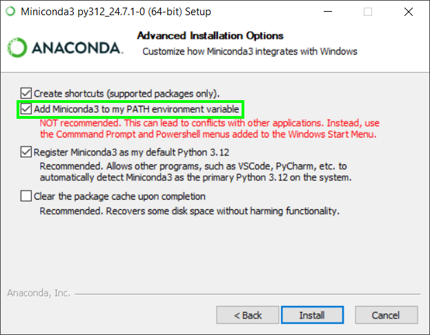
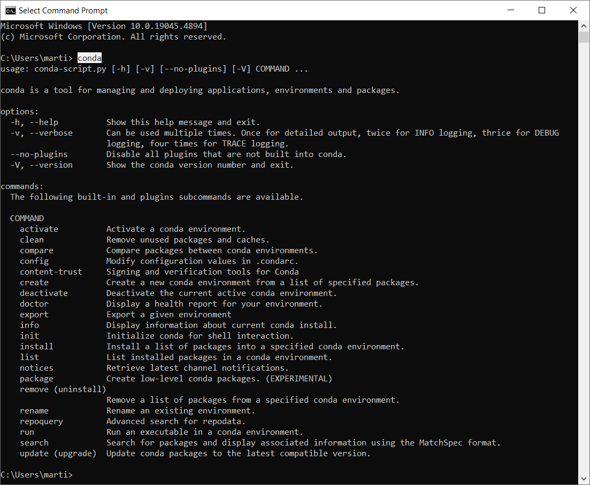
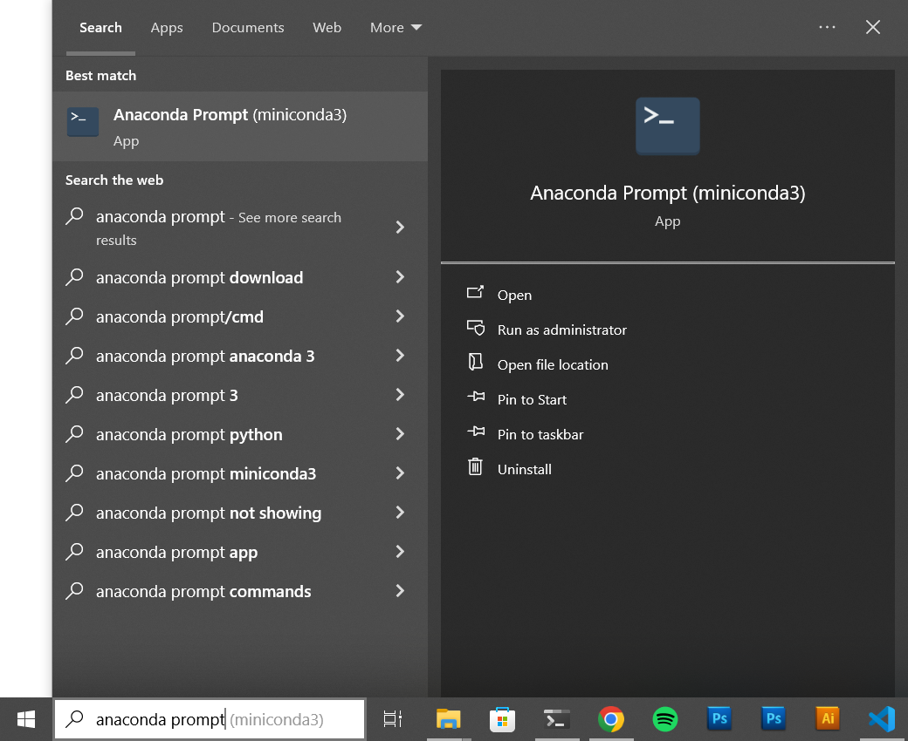

# Conda installation on Windows

1. Download and run the [Miniconda3-latest-Windows-x86_64.exe](https://repo.anaconda.com/miniconda/Miniconda3-latest-Windows-x86_64.exe) installer (or download it from [https://docs.anaconda.com/miniconda/](https://docs.anaconda.com/miniconda/)).

2. Go through the setup, you can keep the defaults until you reach the following screen. Here check the "**Add Miniconda3 to my PATH environment variable**". This will make sure the `conda` command is available from your Command Prompt.
 

1. Finish the installation.

2. Open new Command Prompt window and check that `conda` command is available:
 

 

___

 

*Note: If have strong reasons why not to add Anaconda to you PATH environment variable, you can always access the `conda` command in the Anaconda Prompt instead of the Command Prompt:*
 
