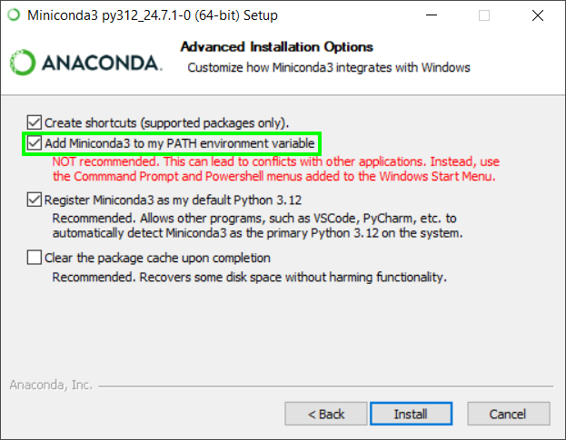
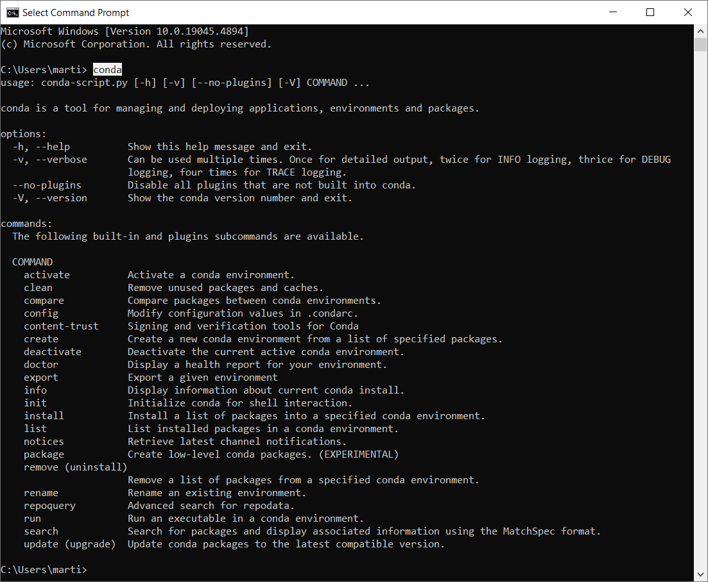
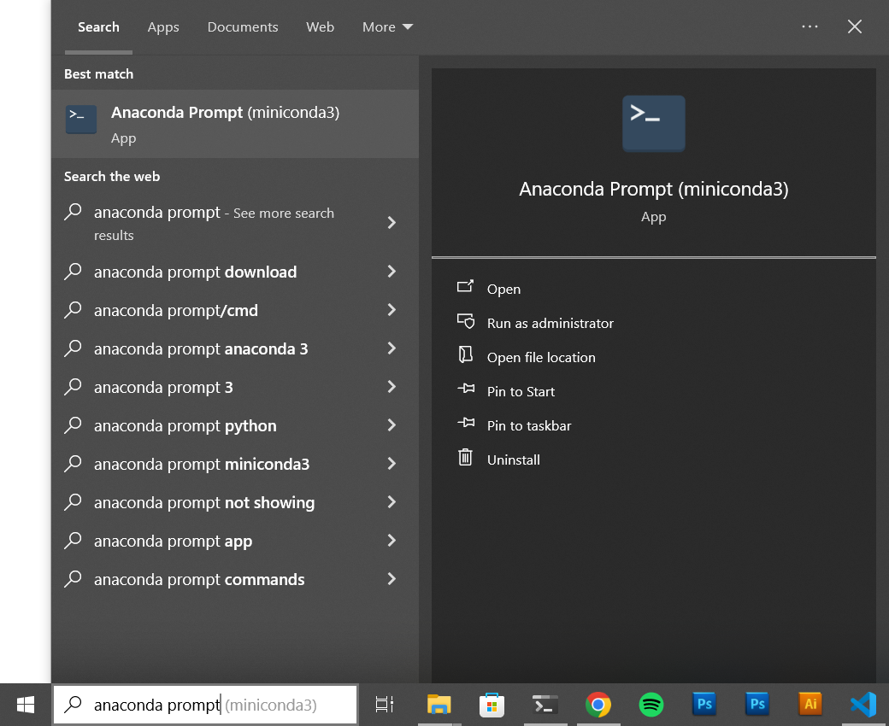

==========================
Conda Windows Installation
==========================

First download and run the https://repo.anaconda.com/miniconda/Miniconda3-latest-Windows-x86_64.exe installer or download it from https://docs.anaconda.com/miniconda/.

Then go through the setup, you can keep the defaults until you reach the following screen. Here check the "**Add Miniconda3 to my PATH environment variable**".
This will make sure the `conda` command is available from your Command Prompt.

Finish the installation.

Verify installation
===================

Open new Command Prompt window and check that `conda` command is available:

Then your conda is successfully installed and you can proceed with the creating environment and installing dependencies.

Alternative to including Anaconda in PATH
=========================================

If have strong reasons why not to add Anaconda to you PATH environment variable, you can always access the `conda` command in the Anaconda Prompt instead of the Command Prompt:

