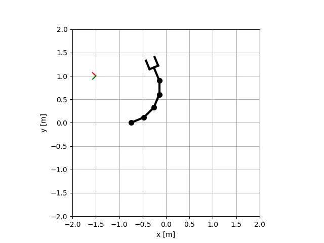

# Lab04 - Inverse kinematics

The goal is to implement numerical inverse kinematics for arbitrary planar manipulator
and analytical inverse kinematics for RRR manipulator.

## Numerical IK

Generated by a script `exercise/lab04/01_numerical_ik.py`:



## Analytical IK

Generated by a script `exercise/lab04/02_analytical_ik.py`:

RRR (mandatory)


PRR (optional)


## Tests

Mandatory HW:

- `robotics_toolbox/robots/planar_manipualator.py`
    - implement numerical IK in `ik_numerical` functions
    - implement analytical IK of RRR manipulator in `ik_analytical` functions

Optional HW:
- `robotics_toolbox/robots/planar_manipualator.py`
  - implement analytical IK of PRR in `ik_analytical` functions

If following tests will pass, your implementation is correct:

```bash
pytest tests/hw04/mandatory
pytest tests/hw04/optional
```

## Notes for the lab

- how many solutions numerical/analytical IK have? 3DoF, 4DoF, 5DoF, etc.
- why not analytical solution for high DoF?
