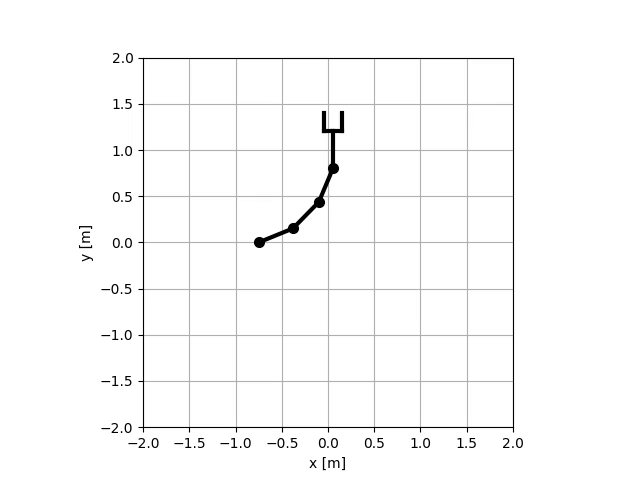
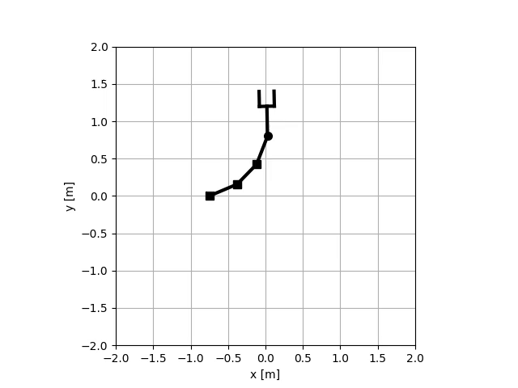
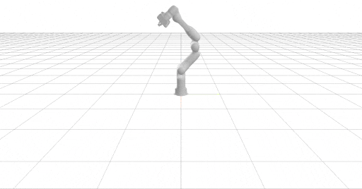

================================
Lab03: Differentiable kinematics
================================

The goal of this laboratory is to implement computation of Jacobian for planar manipulator and to generate null-space motion of the robot, i.e. motion where gripper remains stable while body is moving.
Once you implement the Jacobian computation, you can generate following animations by using the scripts in the `excersies/lab03_differentiable_kinematics` folder:

Planar RRRR
===========

Planar PPPR
===========

Spatial Panda
=============

Tests
=====

Mandatory HW:

- `robotics_toolbox/robots/planar_manipualator.py`
    - implement numerical computation of the in the `jacobian_finite_difference` functions
    - implement analytical computation of in the `jacobian` function; you are not allowed to compute it by numerical difference!

If following tests will pass, your implementation is correct:

.. code-block:: bash

    pytest tests/hw03/mandatory

At the end of the lab, you should be able to answer following questions:

- how to compute Jacobian via finite difference
- what is dimension of null-space? experiment with multi-dof planar robots
- how to compute Jacobian analytically 
