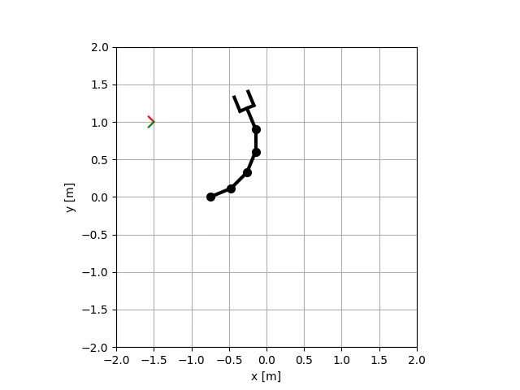
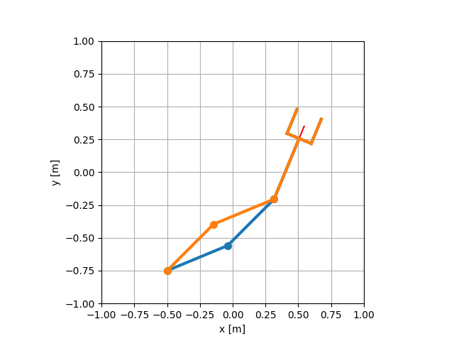
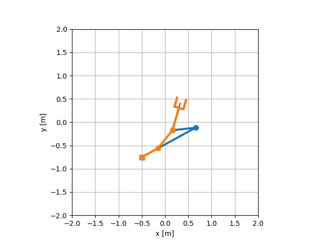

==========================
Lab04: Inverse kinematics
==========================

The goal is to implement numerical inverse kinematics for arbitrary planar manipulator
and analytical inverse kinematics for RRR manipulator.

Numerical IK
============

Generated by a script `exercise/lab04_inverse_kinematics/01_numerical_ik.py`:



Analytical IK
=============

Generated by a script `exercise/lab04_inverse_kinematics/02_analytical_ik.py`:

RRR (mandatory)



PRR (optional)




Tests
=====

Mandatory HW:

- `robotics_toolbox/robots/planar_manipualator.py`
    - implement numerical IK in `ik_numerical` functions
    - implement analytical IK of RRR manipulator in `ik_analytical` functions

Optional HW:

- `robotics_toolbox/robots/planar_manipualator.py`
    - implement analytical IK of PRR in `ik_analytical` functions

If following tests will pass, your implementation is correct:

```bash
pytest tests/hw04/mandatory
pytest tests/hw04/optional
```


At the end of the lab, you should answer the following questions:

- how many solutions numerical/analytical IK have?
- why analytical solution is not used for high DoF robots?
