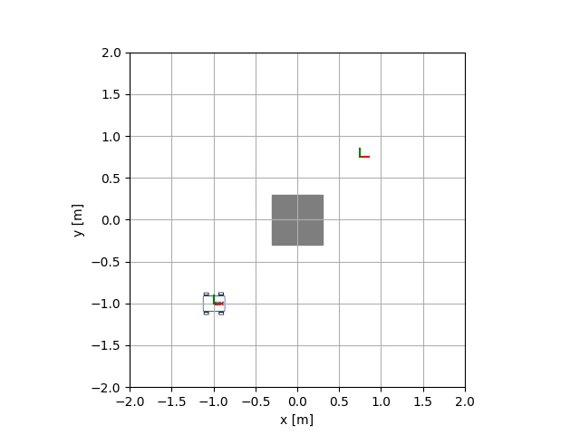
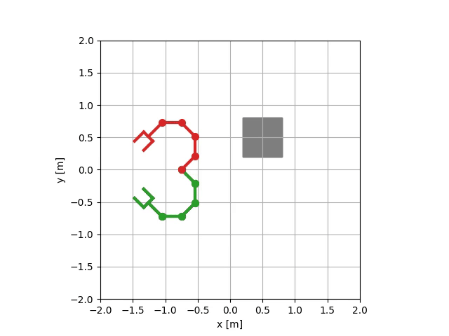
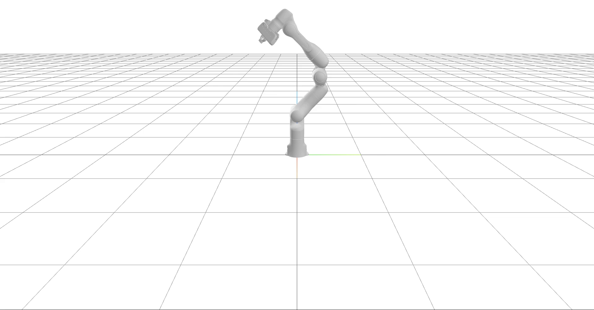
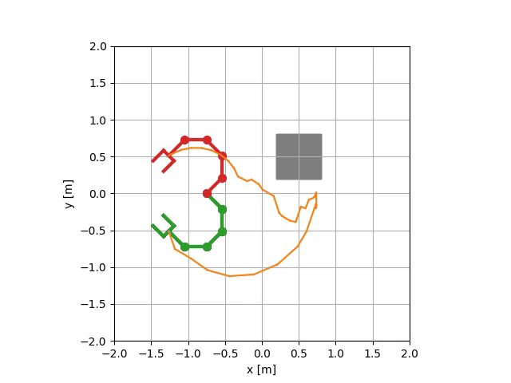

=======================
Lab06: Motion planning
=======================

The goal is to implement RRT algorithm for path planning and random shortcut algorithm for path simplification.
It is important to implement bias toward goal in sampling algorithm for algorithm to find path in limited time given by our tests. 
If planner works, you can visualize paths for various motion planning problems with scripts in `exercises/lab06_planning` folder, e.g.:







Path simplification visualization:




Tests
=====

Optional HW:

- `robotics_toolbox/planning/rrt.py`
    - implement `plan` function
    - implement `random_shortcut` function

If following tests will pass, your implementation is correct:

```bash
pytest tests/hw06/optional
```
