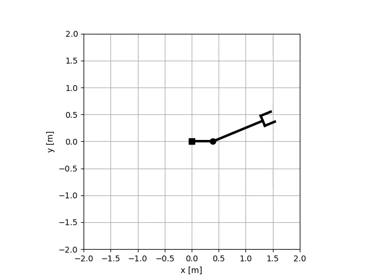
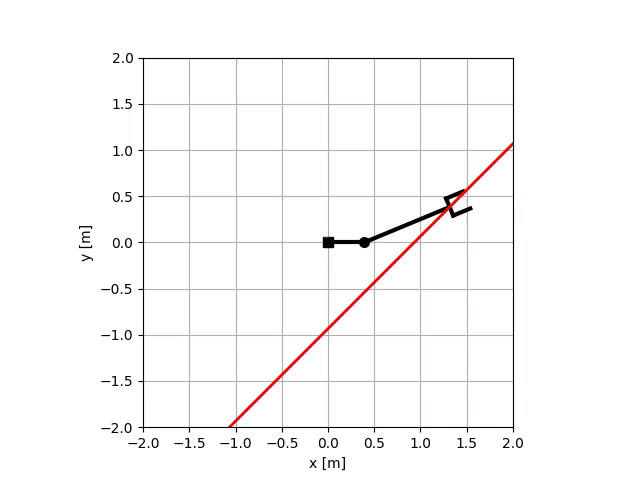

======================
Lab07: Robot Dynamics
======================

The goal of this lab is to implement forward dynamics, inverse dynamics, and constrained forward dynamics for a robot manipulator with kinematics structure PR with first link aligned with x-axis (i.e. alpha1 = 0).
You will implement required functionality in `robotics_toolbox/robots/planar_manipulator_dynamics.py` file.

The constraints for the constrained dynamics are specified by matrix `A` and `dA` that should encode the constraints in the form `A dq = 0`.
Prefix `d` denotes the time derivative of the variable.
The constraint enforce griper to lie on the line that pass through end-effector initial configuration and which angle w.r.t. x-axis is 45 degrees.

If your implementation is correct, you will see dynamical motion of the robot with scripts in `exercises/lab07_dynamics` folder.
You should see animations like this:






Tests
=====

Optional HW:

- `robotics_toolbox/robots/planar_manipulator_dynamics.py`
    - implement `mass_matrix` function
    - implement `h` function
    - implement `forward_dynamics` function
    - implement `inverse_dynamics` function
    - implement `constrained_forward_dynamics` function

If following tests will pass, your implementation is correct:

```bash
pytest tests/hw07/optional
```
